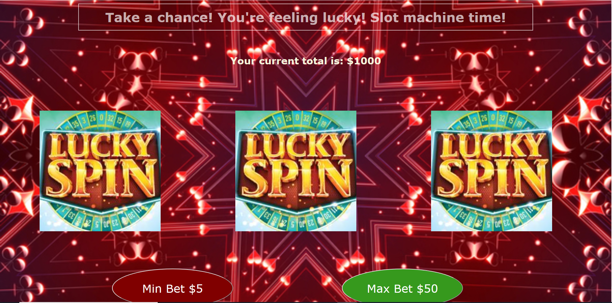

# 🎰 Week05 Bootcamp2019 Project: Slot Machine

### Goal: Build a Simple Slot Machine

Build a simple slot machine with minimum 5 items per reel and 3 reels - user should be able to bet min or max and have their total update

### How I did it:

- Created using HTML CSS and JS
- Made three sections that would be the "reels"
- Made two buttons that have event listeners, when they're clicked, they call a function that does 3 randomm number generations
- Depending on the range of the results, the background image of the sections would change and specific counters would keep track of how many of each image were displayed
- The display of how much money the user has would change based on if any of the counters reached 3 or not
- The change would be calculated based on the input, the buttons that were clicked provided the input (5 or 50)
  - If the amount of money dropped below 51, the money counter would say the user has a gambling problem
